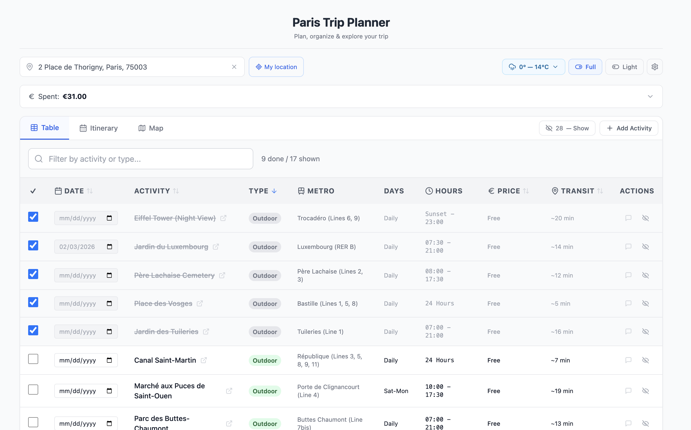
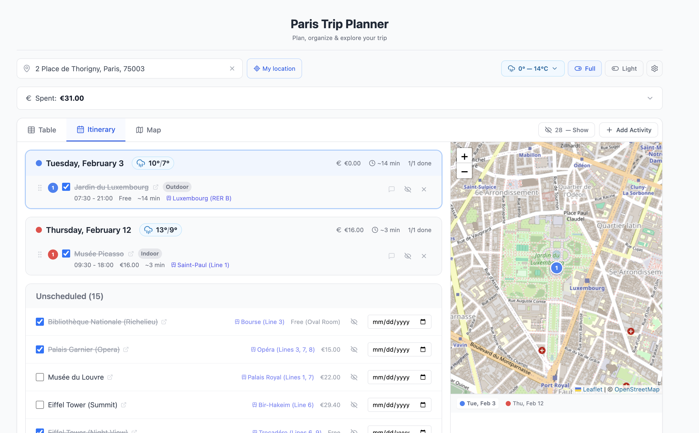
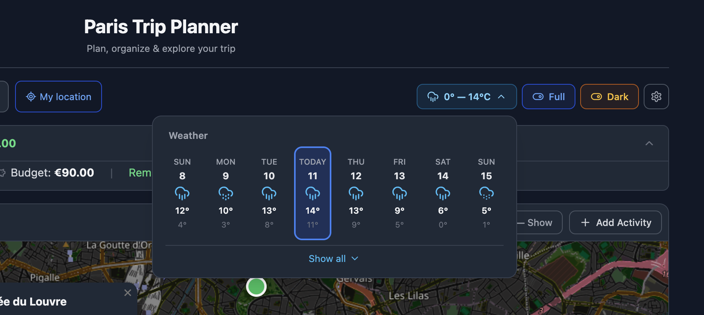
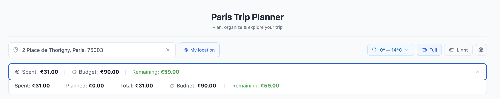
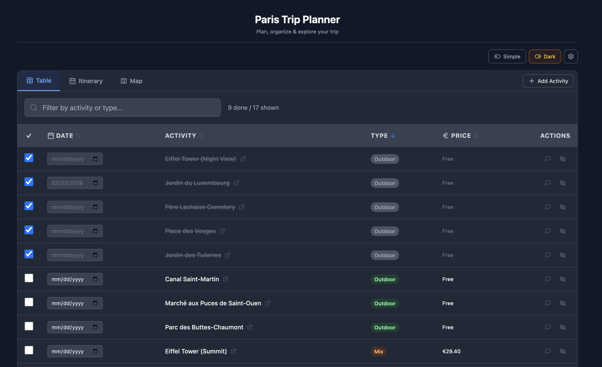

# Paris Trip Planner

A feature-rich, offline-capable web app to plan, organize, and explore your Paris trip. Built with React, Leaflet maps, and Tailwind CSS — no backend required.

**[Live Demo](https://jasur-2902.github.io/paris-travel-guide-app/)**



---

## Features

### Activity Management
- **48 pre-loaded Paris activities** — museums, landmarks, parks, restaurants, and more
- **Sortable table** with columns for date, type, metro station, hours, price, and transit time
- **Filter & search** — instantly find activities by name or type
- **Completion tracking** — check off visited places with animated checkmarks
- **Hide/unhide** activities you're not interested in
- **Add custom activities** — geocoded address search for any location in France
- **Notes** — add personal notes to any activity

### Itinerary Planner
- **Drag-and-drop** day-by-day itinerary with @dnd-kit
- **Split view** — itinerary panel + interactive map side by side
- **Day route lines** on the map connecting planned activities
- **Closed-day warnings** — alerts when an activity is likely closed on your planned date



### Interactive Map
- **Leaflet map** with color-coded markers by activity type
- **Popups** with full activity details, metro info, and Google Maps links
- **Your base location** marker with custom styling
- **Day route visualization** — dashed lines connecting same-day activities


### Weather Integration
- **16-day forecast + 14-day archive** from Open-Meteo API
- **Weather pill** in the toolbar — collapsed summary with expandable 8-day grid
- **Click any day** to jump to that date in your itinerary
- **Weather icons** mapped from WMO codes to Lucide icons



### Budget Tracker
- **Collapsible budget bar** — spent, budget, and remaining at a glance
- **Expandable details** — planned costs, total breakdown, editable budget target
- **Color-coded** remaining balance (green = under budget, red = over)



### Transit Times
- **Hybrid calculation** — OSRM walking times + metro estimation
- **Set your base address** via search or geolocation
- **Per-activity transit times** updated automatically
- **Day trip detection** — locations outside Paris keep default times

### Dark Mode
- **Full dark theme** with dark map tiles (CSS filter inversion)
- **Dark Leaflet popups and controls** — seamless dark experience
- **Persisted** to localStorage — remembers your preference


### Simple & Full Views
- **Simple mode** — streamlined interface showing only essential columns (date, activity, type, price)
- **Full mode** — all columns plus weather pill, budget tracker, and hidden items toggle
- **Smart defaults** — new users start in Simple mode; returning users get their saved preference



### Multi-Language Support
- **English, Spanish, and French** — 170+ translation keys
- **Instant switching** via language selector in Settings
- **Persisted** language preference

### Additional Features
- **Onboarding tutorial** — 7-step spotlight walkthrough on first visit, replayable from Settings
- **Trip Stats dashboard** — completion progress, type breakdown, cost and transit totals
- **Contextual travel tips** — dismissible alerts for rainy days, busy schedules, unplanned activities
- **Copy itinerary** — one-click clipboard copy of your day-by-day plan
- **Export CSV** — download all activity data as a spreadsheet
- **Print stylesheet** — clean printable layout
- **PWA / offline support** — installable as a standalone app with service worker caching
- **Mobile responsive** — card layout on small screens, floating action button, touch-optimized

---

## Getting Started

### Prerequisites
- Node.js 18+ and npm

### Installation

```bash
git clone https://github.com/jasur-2902/paris-travel-guide-app.git
cd paris-travel-guide-app
npm install
```

### Development

```bash
npm run dev
```

Opens at `http://localhost:5173/paris-travel-guide-app/`

### Production Build

```bash
npm run build
npm run preview
```

### Deploy to GitHub Pages

```bash
npx gh-pages -d dist
```

---

## User Guide

### 1. Setting Your Base Location
Enter your hotel or apartment address in the search bar at the top, or click **My location** to use GPS. Transit times for all activities update automatically based on your position.

### 2. Browsing Activities
The **Table** tab shows all activities with sortable columns. Click any column header to sort. Use the search bar to filter by name or type (e.g., "museum", "outdoor").

### 3. Planning Your Itinerary
Assign dates to activities using the date picker in the Table view. Switch to the **Itinerary** tab to see your day-by-day plan. Drag and drop to reorder activities within a day.

### 4. Exploring the Map
The **Map** tab shows all activities as color-coded pins. Click a marker to see details and open directions in Google Maps. Dashed lines connect activities planned for the same day.

### 5. Tracking Your Budget
In Full view, the budget bar appears below the address input. Click to expand and set a budget target. It tracks spent (completed activities) vs. planned costs automatically.

### 6. Checking Weather
The weather pill in the toolbar shows the temperature range for the next 8 days. Click to expand the full forecast grid. Click any day to jump to your itinerary for that date.

### 7. Switching Views
- **Simple** — fewer columns, no weather pill or budget bar. Great for quick planning on mobile.
- **Full** — all features visible. Best for detailed desktop planning.

### 8. Dark Mode
Toggle between light and dark themes using the Light/Dark button. The map tiles automatically adapt.

### 9. Adding Custom Activities
Click **+ Add Activity** to add your own places. Search for an address, pick a type, set hours and price. Custom activities support all features including transit calculation.

### 10. Exporting & Sharing
- **Copy itinerary** — copies a formatted day-by-day plan to your clipboard
- **Export CSV** — downloads all activity data as a spreadsheet
- Both options are available in the Settings menu (gear icon)

### Keyboard Shortcuts
| Key | Action (during tutorial) |
|-----|--------------------------|
| `→` / `Enter` | Next step |
| `←` | Previous step |
| `Esc` | Close tutorial |

---

## Architecture

### Tech Stack

| Layer | Technology |
|-------|-----------|
| UI Framework | React 18 |
| Build Tool | Vite 6 |
| Styling | Tailwind CSS 3.4 |
| Maps | Leaflet + react-leaflet |
| Drag & Drop | @dnd-kit |
| Icons | lucide-react |
| PWA | vite-plugin-pwa |
| Weather API | Open-Meteo (no API key) |
| Geocoding | Photon / Komoot |
| Routing | OSRM (foot profile) |

### Project Structure

```
src/
├── App.jsx                 # Main component, state management, header controls
│                           # WeatherPill, WeatherSkeleton, SettingsMenu, LanguageSelector
├── TableView.jsx           # Table (desktop) + card layout (mobile < 768px)
│                           # Kebab overflow menu, sortable columns
├── DayPlanner.jsx          # Drag-and-drop itinerary with weather display
│                           # Pointer + keyboard sensors, dark map tiles
├── MapView.jsx             # Leaflet map with markers, day routes, dark tiles
├── BudgetTracker.jsx       # Collapsible budget: summary bar + expandable details
├── TripStats.jsx           # Collapsible stats: progress, type breakdown, costs
├── TripTips.jsx            # Contextual dismissible tips (rainy days, busy days)
├── AddActivityModal.jsx    # Modal for custom activities with geocoding + focus trap
├── Tutorial.jsx            # Spotlight onboarding walkthrough (7 steps)
├── i18n.jsx                # Internationalization: EN/ES/FR, 170+ keys, React Context
├── utils.js                # Helpers: parsePrice, getTypeColor, getWeatherInfo,
│                           # estimateHybridTransit, initialData (48 activities)
├── index.css               # Tailwind directives, animations, dark map overrides,
│                           # tutorial spotlight, print stylesheet
└── main.jsx                # Entry point, LanguageProvider wrapper
```

### State Management

All state lives in `App.jsx` using React `useState` and `useCallback`. No external state library.

```
App.jsx (state owner)
├── items[]              → Activity data (preset + custom)
├── userLocation         → Base address coordinates
├── weather{}            → Date-keyed weather data
├── viewMode             → 'simple' | 'full'
├── darkMode             → boolean
├── activeTab            → 'table' | 'planner' | 'map'
├── budget               → number
├── tutorialActive       → boolean
└── ... (UI state: sort, search, modals, notifications)
```

### Data Persistence

Everything is persisted to `localStorage` — no server or database needed:

| Key | Data |
|-----|------|
| `paris-activities` | Activities, custom items, location, sort config, active tab, budget |
| `paris-trip-view` | View mode (simple/full) |
| `paris-trip-dark` | Dark mode preference |
| `paris-trip-lang` | Language code (en/es/fr) |
| `paris-trip-tutorial-done` | Tutorial completion flag |
| `paris-trip-tips-*` | Dismissed tip IDs |

### API Integrations

All APIs are free, keyless, and CORS-friendly:

| API | Purpose | Endpoint |
|-----|---------|----------|
| Open-Meteo Forecast | 16-day weather forecast | `api.open-meteo.com/v1/forecast` |
| Open-Meteo Archive | 14-day historical weather | `archive-api.open-meteo.com/v1/archive` |
| Photon (Komoot) | Address geocoding + reverse geocoding | `photon.komoot.io/api` |
| OSRM | Walking time calculation (table API) | `router.project-osrm.org/table/v1/foot` |

### Component Data Flow

```
App.jsx
 ├── WeatherPill          ← weather, locale, t
 ├── BudgetTracker        ← items, budget, onBudgetChange
 ├── TableView            ← items, sortConfig, callbacks
 ├── DayPlanner           ← items, weather, userLocation, darkMode, callbacks
 ├── MapView              ← items, userLocation, darkMode
 ├── TripStats            ← items
 ├── TripTips             ← items, weather
 ├── AddActivityModal     ← onAdd, onClose
 ├── Tutorial             ← active, onClose
 └── SettingsMenu         ← showHidden, export/copy fns, onStartTour
```

### Key Design Patterns

- **Click-outside dismiss** — `useRef` + `useEffect` with `mousedown` listener (settings, weather pill, kebab menus, address dropdown)
- **Hybrid transit estimation** — OSRM walking time + metro heuristic based on distance thresholds
- **Progressive disclosure** — Simple/Full view toggle following Hick's Law
- **Spotlight tutorial** — CSS `box-shadow: 0 0 0 9999px` overlay with positioned tooltip
- **i18n via React Context** — `useLanguage()` hook provides `t()` function with parameter interpolation
- **Responsive breakpoints** — Desktop table at `md+`, card layout below; responsive grid for weather

---

## License

MIT

---

Built with React + Vite + Tailwind CSS
